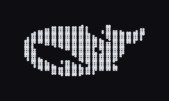
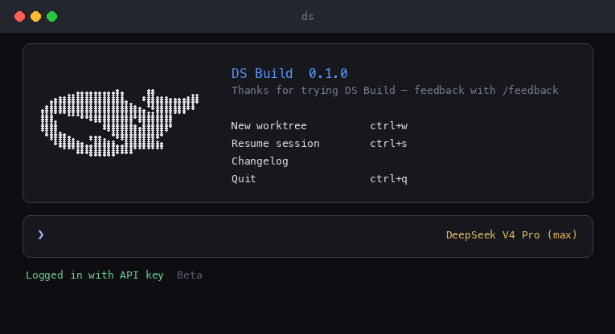
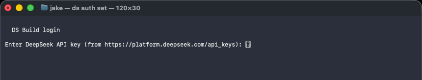

# DS Build (`ds`)

<p align="center">
  
</p>

**DS Build** is a terminal AI coding agent optimized for
[DeepSeek V4](https://api-docs.deepseek.com/). It runs as a full-screen TUI
(or headless CLI) that can read and edit your codebase, run shell commands, and
orchestrate multi-step work — including parallel subagents.

<p align="center">
  
</p>

<p align="center"><em>Welcome screen (real TUI) — logo, session menu, shortcuts.</em></p>

<p align="center">
  
</p>

<p align="center"><em>Login (real Terminal): <code>ds auth set</code> — paste your DeepSeek API key (input is hidden).</em></p>

---

## Origin & credit

**DS Build is built from the open-source [Grok Build](https://github.com/xai-org/grok-build) codebase.**

Huge thanks to **Elon Musk** and **xAI** for open-sourcing Grok Build — this
project re-vendors and rebrands that work as **DS** for DeepSeek:

| | Grok Build (upstream) | DS Build (this repo) |
|--|--|--|
| Command | `grok` / grok-build | `ds` |
| Home dir | `~/.grok` | `~/.ds` (`DS_HOME`) |
| Crates | `xai-*` / grok crates | `ds-*` |
| Default model / API | xAI Grok | DeepSeek V4 (`api.deepseek.com`) |

First-party product analytics (Mixpanel), Sentry crash reporting, and internal
telemetry phone-home are **off** by default. The only intended network traffic
is your DeepSeek (or other BYOK) API calls.

**→ Full DeepSeek API setup (step-by-step): [`DEEPSEEK.md`](DEEPSEEK.md)**

**→ Porting upstream Grok Build fixes:** [`docs/upstream-sync.md`](docs/upstream-sync.md)
(`./scripts/upstream-sync.sh` — review → classify → selective port; never blind-merge)

[Example config](config.example.toml) ·
[User guide](crates/codegen/ds-pager/docs/user-guide/) ·
[License](#license)

---

## At a glance

| | |
|--|--|
| Command | `ds` |
| Config / sessions | `~/.ds/` (`DS_HOME`) |
| Version | `0.1.0` |
| Default model | `deepseek-v4-pro` |
| Fast model | `deepseek-v4-flash` |
| API | `https://api.deepseek.com/v1` (OpenAI-compatible `chat_completions`) |
| Login | `ds auth set` / first-run paste / `DEEPSEEK_API_KEY` |
| Permissions | **always-approve** by default |
| Subagents | **enabled** by default |
| Reasoning effort | max / high by default on DeepSeek models |

---

## Quick start

### 1. Get a DeepSeek API key

1. Open **https://platform.deepseek.com/api_keys**
2. Create a key (starts with `sk-`)
3. Store it with `ds auth set` (recommended) or env / config — see below

### 2. Build and install `ds`

```sh
cargo build -p ds-pager-bin --release
install -m 755 target/release/ds-pager ~/.local/bin/ds
# macOS: re-sign after copy so Gatekeeper does not kill the binary (exit 137)
codesign --force --sign - ~/.local/bin/ds
export PATH="$HOME/.local/bin:$PATH"   # add to ~/.zshrc if needed
```

### 3. Log in (API key)

**A. Paste on first run / `ds auth set` (recommended)**

```sh
ds auth set
# paste sk-… (not echoed) → saves ~/.ds/config.toml + auth.json

ds auth status   # set / not set (never prints the full secret)
```

On first interactive `ds` launch with no key and a TTY, you get the same
prompt automatically.

**B. Environment variable**

```sh
export DEEPSEEK_API_KEY="sk-..."
# also accepted: DS_API_KEY
```

**C. Manual `~/.ds/config.toml`** — see [`config.example.toml`](config.example.toml)
and [`DEEPSEEK.md`](DEEPSEEK.md). Use singular `[model....]`, not `[models....]`.

### 4. Verify

```sh
ds --version
# expect: ds 0.1.0 (…)

ds auth status

ds -p "Reply with exactly: DEEPSEEK_OK" \
  --model deepseek-v4-flash --always-approve --max-turns 2
# expect: DEEPSEEK_OK

ds   # interactive TUI
```

If you see `Not signed in` or `401 Unauthorized`, re-check the key steps in
[`DEEPSEEK.md`](DEEPSEEK.md#troubleshooting).

---

## Features

- **DeepSeek-first** — defaults for V4 Pro / Flash, chat-completions API, high/max reasoning effort
- **Full TUI** — scrollback, markdown, plans, todos, worktrees, session resume
- **Headless / CI** — `ds -p "…"` for scripts; `--always-approve`, `--max-turns`, etc.
- **Tools** — read/edit/search, terminal, web fetch/search, MCP, skills, subagents
- **Orchestration** — Fable-style plan → execute → verify harness with resource bounds
- **Privacy defaults** — no Mixpanel / Sentry / product phone-home unless you opt in

---

## Building from source

Requirements:

- **Rust** — toolchain pinned by [`rust-toolchain.toml`](rust-toolchain.toml)
  (`rustup` installs it on first build)
- **protoc** — [`bin/protoc`](bin/protoc) (dotslash) or a `protoc` on `PATH` / `$PROTOC`
- macOS and Linux are the primary build hosts; Windows is best-effort

```sh
cargo run -p ds-pager-bin                 # debug build + launch TUI
cargo build -p ds-pager-bin --release     # target/release/ds-pager
cargo check -p ds-pager-bin               # fast validation
```

---

## Defaults (this fork)

| Setting | Default | Override |
|---------|---------|----------|
| Permission mode | always-approve | `[ui] permission_mode = "ask"` or omit always-approve |
| Subagents | on | `DS_SUBAGENTS=0`, `--no-subagents`, or `[subagents] enabled = false` |
| System prompt | Neutral coding-agent prompt + Fable harness | templates under `crates/codegen/ds-agent/templates/` |
| Telemetry / Mixpanel / Sentry | off | only if you explicitly opt in (`DS_TELEMETRY_OPT_IN=1`, etc.) |

Full setup notes: [`DEEPSEEK.md`](DEEPSEEK.md).

---

## Documentation

| Doc | Contents |
|-----|----------|
| [`DEEPSEEK.md`](DEEPSEEK.md) | API key, privacy, defaults, troubleshooting |
| [`config.example.toml`](config.example.toml) | Copy to `~/.ds/config.toml` |
| [`crates/codegen/ds-pager/docs/user-guide/`](crates/codegen/ds-pager/docs/user-guide/) | Keyboard shortcuts, config, MCP, headless, etc. |
| [`docs/images/`](docs/images/) | Login / welcome screenshots |

---

## Repository layout

| Path | Contents |
|------|----------|
| `crates/codegen/ds-pager-bin` | Composition root; builds the `ds-pager` binary (install as `ds`) |
| `crates/codegen/ds-pager` | TUI: scrollback, prompt, modals, rendering |
| `crates/codegen/ds-shell` | Agent runtime + leader/stdio/headless entry points |
| `crates/codegen/ds-tools` | Tool implementations (terminal, edit, search, …) |
| `crates/codegen/ds-workspace` | Host filesystem, VCS, execution, checkpoints |
| `crates/codegen/ds-agent` | Agent definitions + system prompt templates |
| `crates/codegen/...` | Config, MCP, markdown, sandbox, telemetry, … |
| `crates/common/`, `crates/build/`, `prod/mc/` | Shared leaf crates |
| `third_party/` | Vendored Mermaid diagram stack |

> [!IMPORTANT]
> The root `Cargo.toml` (workspace members, dependency versions, lints,
> profiles) is **generated** — treat it as read-only. Prefer editing per-crate
> `Cargo.toml` files.

---

## Development

```sh
cargo check -p <crate>        # prefer per-crate; full workspace is slow
cargo test -p ds-config
cargo clippy -p <crate>
cargo fmt --all
```

After changing system prompt templates under
`crates/codegen/ds-agent/templates/`, regenerate the encrypted blob:

```sh
cd crates/codegen/ds-agent && python3 scripts/encrypt_templates.py
```

---

## Contributing

> [!NOTE]
> External contributions are not accepted. See [`CONTRIBUTING.md`](CONTRIBUTING.md).

## License

First-party code is **Apache License 2.0** — see [`LICENSE`](LICENSE).

This project incorporates and is derived from open-source **Grok Build**
published by **xAI**. Thanks again to **Elon Musk** and the xAI team for
releasing that code. Upstream and third-party components remain under their
original licenses:

- [`THIRD-PARTY-NOTICES`](THIRD-PARTY-NOTICES)
- [`crates/codegen/ds-tools/THIRD_PARTY_NOTICES.md`](crates/codegen/ds-tools/THIRD_PARTY_NOTICES.md)
- [`third_party/NOTICE`](third_party/NOTICE)
